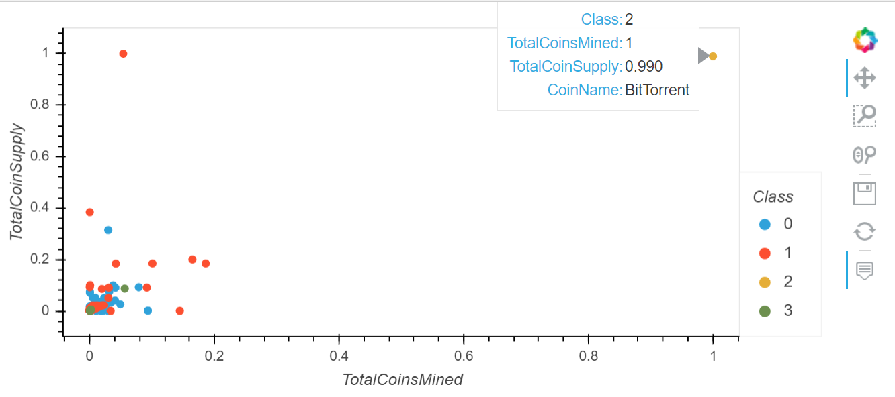
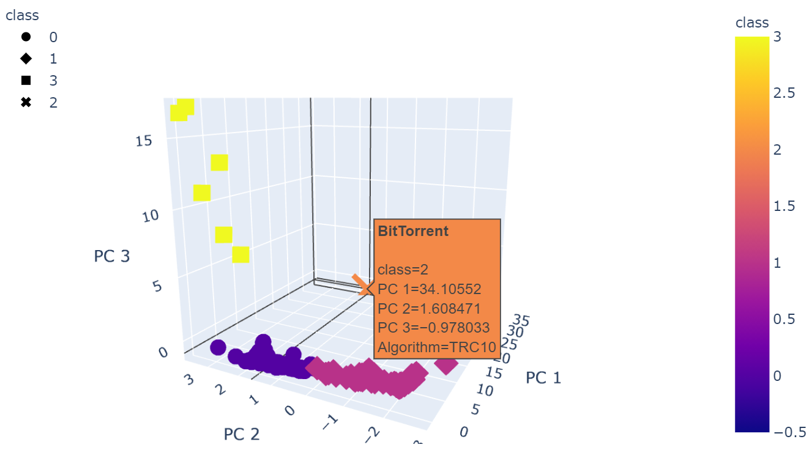

# Cryptocurrencies
Unsupervised machine learning, K-means Clustering, Elbow Curve, Principal Component Analysis (PCA),  Hierarchical Clustering / Agglomerative clustering, Dendrogram

# Overview of the Project
The project helps a investment bank manager for an analysis to create a new cryptocurrency investment portfolio for its customers by applying unsupervised machine learning models to create a report that includes what cryptocurrencies are on the trading market and how they could be grouped to create a classification system for this new investment.  
- Use Python to process the raw dataset of the current cryptocurrency information including the currency names, algorithm, Proof Type, Total Coins Mined so far and total coins supplied.  
- Apply Principal Component Analysis (PCA) to reduce the dimension of principal components.  
- Use Elbow curve to determine the ideal value of clustering.  
- Apply K-means algorithm to cluster the types of crytocurrency  

# Results
- 2D clustering
  
- 3D clustering
  
